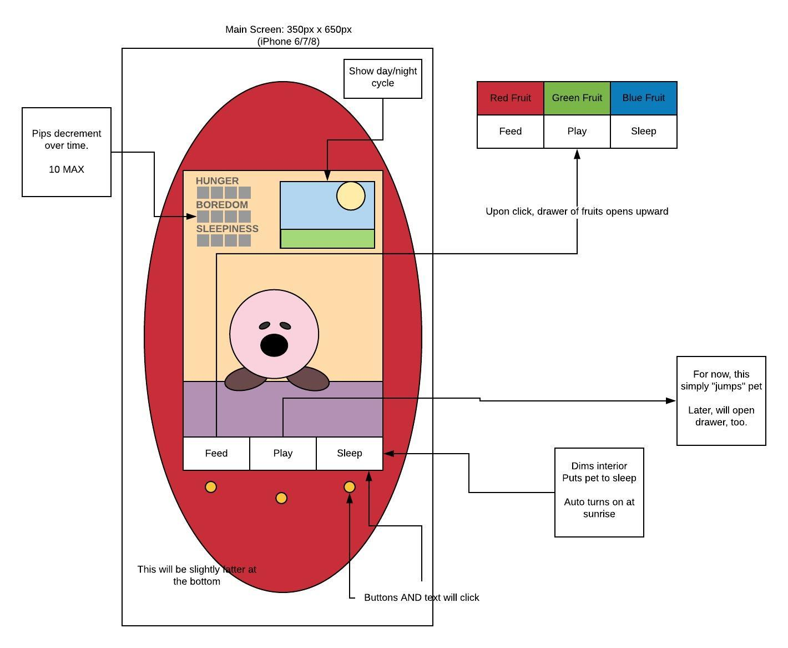

# Zach's Tamagotchi Rep

## User Stories / game logic
### 0: Starting Look
* All there should be onscreen is an egg with spots
  * clicking egg will prompt name for New Tamagotchi
  * Once named, run New Tamagotchi function
* Game "screen" inside a tamagotchi-looking egg (with 3 little buttons)
* Entire thing fit into the height/width of a standard phone

### 1: Creature Settings
* All creatures born with random color (matches egg spots)
* All creatures have random hunger needs (timing)
* All creatures have random growth needs (feed/exercise? Or just timing)
* All creatures start with max Hunger, max Exercise, max Rest
* Tamagotchis start as round balls, but grow upward (and grow extensions) with time
* Extensions chosen at creation (randomly)

### 2: Main functionality
1. 3 buttons appear exist under creature at ALL times
    1. Feed
        * Onclick, it brings up "fruits" menu which has 3 (or 5) fruit colors
        * Fruits can be clicked (dragged?) to feed.
        * Fruits are RGB (maybe B/W)
        * On feed, it restores 1 Hunger bar
        * On feed, it also slightly shifts color of creature.
            * R / G / B adds 1pt to color of choice.
            * Black would add 1pt to all colors
            * White would remove 1pt from all colors
    2. Play ( / Exercise)
        * On click, brings up "play" menu which has 3 (or more) options
    3. Lights (something like this)
        * Dark puts creature to sleep, restoring "Rest" bars (nothing else clickable)
        * Light restores functionality to Feed/Exercise
2. Window behind tamagotchi shows Day/Night
3. Pet has name / can be changed
4. User must click Feed/Play/Lights in order to keep craeture from dying. If hunger/boredom/sleepiness gets to 10, it dies.
5. On death, a final screen displays stats, provides a button to play again.

### 3: Back end
1. Tamagotchis created from standard Class
    * Hunger level (Max 10)
    * Boredom level (Max 10)
    * Sleepiness level (Max 10)
    * Age
    * Amount overfed (food beyond hunger)
    * Amount overworkout (exercise beyond need)
    * Height/Width
    * Translate (based on overfed vs overworkout--makes "fat" or "V shaped")
2. Timer keeps track of "Days" passed

## Missing Details
1. How often are Days?
    * Every 1 minutes
    * 30 seconds = Day
    * 30 seconds = Night
2. How often does sleepiness tick up?
    * 1 pip every 10 seconds during the day
    * 1 pip per every 5 seconds at night if awake
    * 1 pip per "play"
3. How does sleepiness reduce?
    * 1 pip per every 5 seconds asleep
4.  How often does hunger tick up?
    * Regular movement
    * 3 pip per 15 seconds during day (Mid Day, End of Day)
5. How does hunger reduce?
    * 2 pips per fruit eaten
6.  How often does boredom tick up?
    * slowest
    * Once per Day (beginning of Day)
    * 3 Pips lost at once
7. How does boredom reduce?
    * 2 pips per activity
8. At what ages does pet "grow"?
    * After 10 Days
9. What growth options are there?
    * Hands
    * Feet
    * Tail
    * Ears
    * Nose
    * Eyebrows
    * Belly
    * Neck?
    * Hair?
10. What Play options are there? How do they work?
    * Jump (MVP)
11. What animations are there?
    * Egg Movement
    * Standard
    * Play/exercise
    * Sleep
    * Death
    * Bored

## Wireframe
